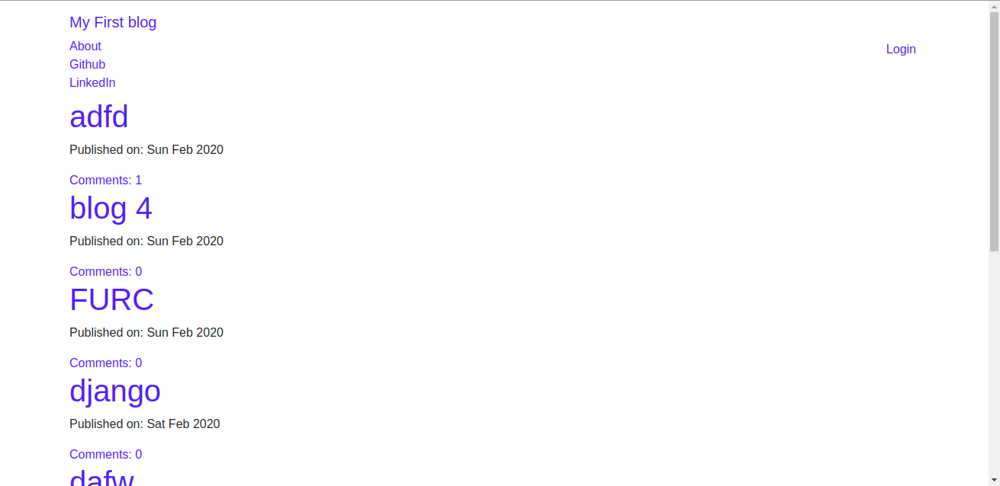
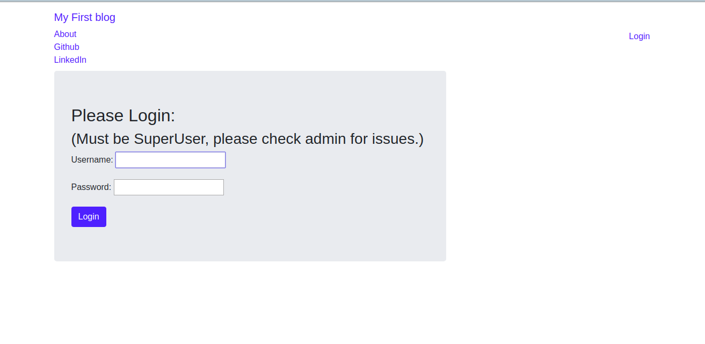
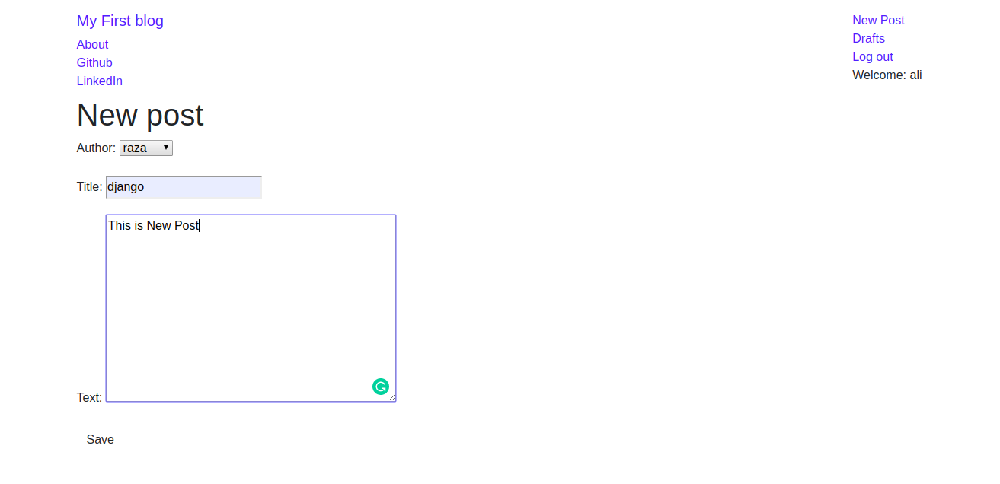

# First_Blog_Django
this is django application for blog management. 
Its interface looks simple but its powerful application implemented using CBVs
 
only superusers can publish a post.  
anyone can write a comment. 
comments can only be approved or deleted by author.

python = 3.8  
django = 2.2.5

 

 

 

